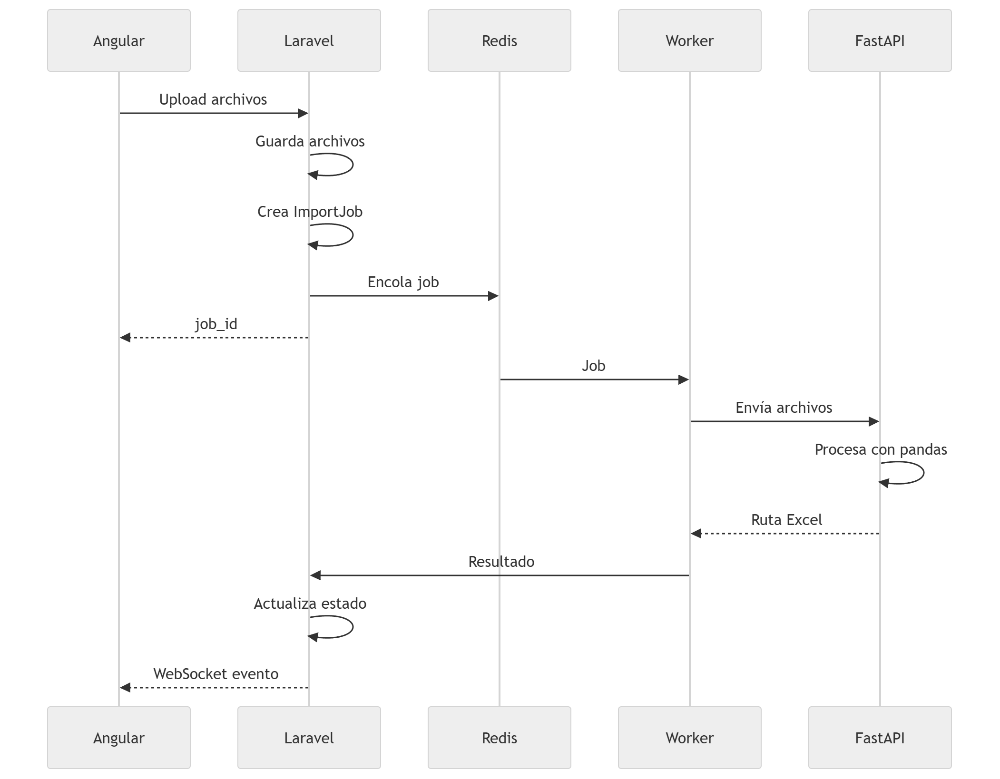

# PLAN DE ACCIÓN

### FLUJO DE PROCESAMIENTO

```md
Angular
    ↓ HTTP
Laravel 13
    ├── Recibe archivos → S3 o storage local
    ├── Crea ImportJob en DB
    ├── Encola Job → Redis
    └── Retorna job_id al Angular

Redis (cola)
    ↓
Laravel Queue Worker
    ↓ HTTP
FastAPI (Python)
    ├── pandas lee cada archivo
    ├── concatena todos los DataFrames
    ├── limpia y valida filas
    ├── genera Excel con openpyxl
    └── devuelve path del archivo generado

Laravel
    ├── Actualiza estado del job en DB
    └── Notifica via WebSocket (Laravel Reverb)
            ↓
        Angular muestra progreso en tiempo real

```

### DIAGRAMA DE SECUENCIA

<table>
  <tr>
    <td bgcolor="white">
      
    </td>
  </tr>
</table>

### 🧱 TECNOLOGÍAS UTILIZADAS
- Frontend: Angular
- Backend: Laravel 13
- Colas: Redis
- Worker: Laravel Queue
- Procesamiento: FastAPI + pandas
- Tiempo real: Laravel Reverb (WebSockets)
